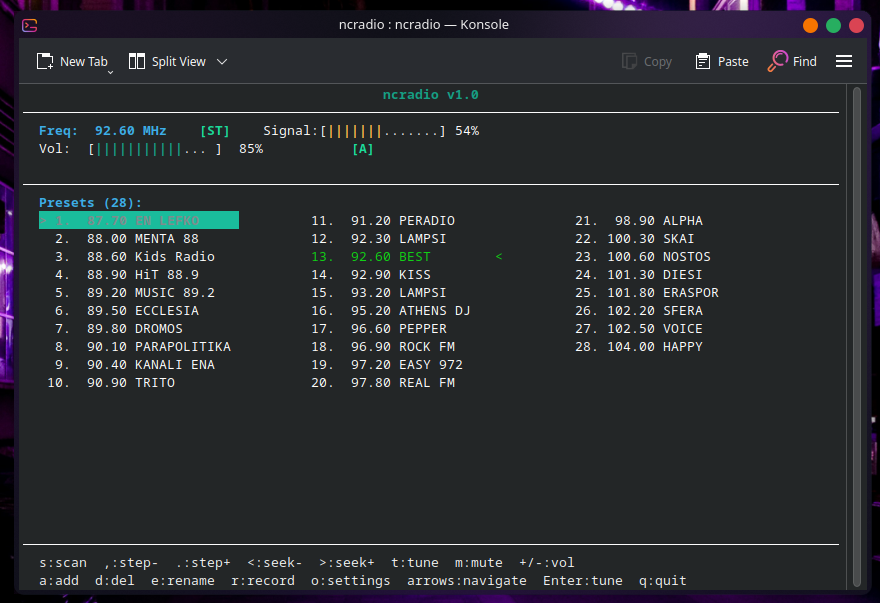

# ncradio

A small ncurses FM radio controller for Linux, built for V4L2-compatible tuner
cards and USB radio sticks accessible as `/dev/radio0`. Includes a live audio
pipe that routes the tuner's capture output to the system's default playback
device. Tested on Fedora 44 with ADS Tech InstantFM Music RDX-155.



## Requirements

**Runtime:**
- Linux kernel with V4L2 radio support (`/dev/radio0`)
- PipeWire (preferred) **or** ALSA (`libasound`) for audio output (optional; falls back to tuner control only)
- `libudev` for automatic audio device detection (optional; falls back to sysfs)
- `libmp3lame` for MP3 recording (optional)

**Build:**
- `ncurses` development headers (`ncurses-devel` / `libncurses-dev`)
- `libpipewire-0.3` development headers (`pipewire-devel` / `libpipewire-0.3-dev`) — preferred
- `alsa-lib` development headers (`alsa-lib-devel` / `libasound2-dev`) — fallback if PipeWire not found
- `libudev` development headers (`systemd-devel` / `libudev-dev`) — optional
- `lame` development headers (`lame-devel` / `libmp3lame-dev`) — optional
- GCC and GNU make

## Build

```sh
./configure
make
```

`configure` detects audio backends automatically: PipeWire is used when
available; ALSA (`libasound`) is the fallback. It writes `config.mk`. Run
`./configure --help` for all options:

| Option | Effect |
|--------|--------|
| `--disable-audio` | Build without audio support |
| `--enable-audio` | Require audio (fail if no backend found) |
| `--disable-pipewire` | Prefer ALSA even if PipeWire is available |
| `--disable-udev` | Use sysfs-only device autodetection; do not link libudev |
| `--disable-lame` | Build without MP3 recording support |

Optional install to `/usr/local/bin`:

```sh
sudo make install
```

## Usage

```sh
./ncradio              # uses /dev/radio0
./ncradio /dev/radio1  # alternate device
./ncradio -v           # print version and build configuration, then exit
./ncradio --version    # same
```

The version output shows the audio backend and optional component versions:

```
ncradio 0.1 built  May 30 2026 18:34:51
by Constantinos Tsakiris

  Audio backend:         PipeWire 1.6.6
  Device autodetect:     libudev 259 + sysfs
  MP3 recording:         lame 3.100
```

or, when built against ALSA:

```
ncradio 0.1 built  May 30 2026 18:34:51
by Constantinos Tsakiris

  Audio backend:         ALSA (libasound 1.2.15.3)
  Device autodetect:     libudev 259 + sysfs
  MP3 recording:         lame 3.100
```

The tuner device must be readable and writable by the current user. On most
distributions, add yourself to the `video` group:

```sh
sudo usermod -aG video $USER
```

On startup ncradio restores the last tuned frequency and volume from
`~/.ncradio.conf`. On exit the tuner is muted, then the current frequency
and volume are persisted.

## Key Bindings

### Normal mode

| Key | Action |
|-----|--------|
| `s` | Full band scan (87.50 – 108.00 MHz) |
| `,` | Step frequency down by the configured scan step |
| `.` | Step frequency up by the configured scan step |
| `<` | Seek backward — find previous station at or above signal threshold |
| `>` | Seek forward — find next station at or above signal threshold |
| `t` | Manual tune — type a frequency in MHz, then Enter |
| `+` or `=` | Volume up (5% step) |
| `-` | Volume down (5% step) |
| `m` | Toggle mute |
| `r` | Start recording to MP3 (requires audio enabled; prompts for filename) |
| `a` | Add current frequency to presets |
| `d` | Delete the highlighted preset |
| `e` | Rename the highlighted preset |
| `o` | Open settings panel |
| `↑` / `↓` | Move selection down/up within the current preset column |
| `←` / `→` | Move selection one column left/right in the preset grid |
| `PgUp` / `PgDn` | Scroll preset list by one visible window of rows |
| `Enter` | Tune to the highlighted preset |
| `q` | Quit |

### Tuning mode (after pressing `t`)

| Key | Action |
|-----|--------|
| `0`–`9` | Enter digit |
| `.` or `,` | Decimal point (both accepted) |
| `Backspace` | Delete last character |
| `Enter` | Confirm and tune |
| `Esc` | Cancel |

### Rename mode (after pressing `e`)

| Key | Action |
|-----|--------|
| Printable chars | Append to name (max 32 characters) |
| `Backspace` | Delete last character |
| `Enter` | Save name |
| `Esc` | Cancel without saving |

### Scan mode

| Key | Action |
|-----|--------|
| `s` | Stop scan early, save results |
| `Esc` | Stop scan, discard results |

### Seek mode (after pressing `<` or `>`)

| Key | Action |
|-----|--------|
| Any key | Cancel seek and restore previous frequency |

### Record filename mode (after pressing `r`)

| Key | Action |
|-----|--------|
| Printable chars | Append to filename (`.mp3` added automatically if omitted) |
| `Backspace` | Delete last character |
| `Enter` | Start recording |
| `Esc` | Cancel |

### Recording mode

All tuning, scanning, seeking, mute, and settings keys are blocked while recording.

| Key | Action |
|-----|--------|
| `s` or `Esc` | Stop recording and save file |

The info row shows `- REC 0:00 filename` with a running elapsed time.

### Settings panel (after pressing `o`)

| Key | Action |
|-----|--------|
| `↑` / `↓` | Select setting |
| `←` / `→` | Adjust value |
| `Enter` | Toggle boolean settings |
| `Esc` or `o` | Close settings |

## Status display

### Stereo / mono

`[ST]` (green) is shown next to the frequency when the tuner detects a stereo
pilot tone. `[MO]` (dim) is shown when the signal is monophonic or too weak
for stereo decoding.

### RDS

If the tuner hardware supports RDS (`V4L2_TUNER_CAP_RDS`), ncradio decodes
incoming RDS data automatically:

| Element | Location | Description |
|---------|----------|-------------|
| PS name | Right of volume bar | 8-character station name (e.g. `Capital FM`) appears in green once all 4 RDS segments arrive — typically 1–2 s |
| Radio Text | Info row | Up to 64-character "now playing" text; shown when no status message is pending |

RDS data is cleared whenever the frequency changes (tune, step, seek, or
preset selection). On hardware without RDS support these areas stay blank.

### Audio indicator

`[A]` (green) appears on the volume row while the audio pipe is running.
`[A!]` (red) appears if the pipe stopped due to an error; the error text
is shown in the settings panel next to the **Audio output** row.

## Stepping, scanning, and seeking

### Manual step (`,` / `.`)

Step the tuner by the configured **Scan step** in either direction. The same
step size applies to both manual browsing and the automatic band scan.

### Automatic scan (`s`)

A full band sweep from 87.50 to 108.00 MHz runs in a background thread so the
UI stays responsive. A progress bar and a live list of found stations are shown
during the sweep; the list auto-scrolls to always show the most recently found
station.

**RDS name collection** — if `Save RDS names` is enabled (default: Yes), the
scanner dwells on each found station for up to 1.5 s to collect its RDS PS
name, exiting early once the name is received.

When the scan finishes (or is stopped), all found stations **replace** the
current preset list and are saved to `~/.ncradio.conf`. The tuner returns to
the frequency it was on before the scan.

### Software seek (`<` / `>`)

Seek steps through frequencies in the configured direction using the same scan
step and signal threshold as the automatic scan, stopping at the first
frequency that meets or exceeds the threshold. Seek runs in a background thread
— the UI remains responsive and any keypress cancels it. If no qualifying
station is found after a full sweep of the band, the tuner is restored to its
pre-seek frequency and a "No station found" message is shown.

## Audio output

ncradio pipes the tuner's audio directly to the system's playback device. The
audio backend is selected at build time by `configure`.

### PipeWire backend (default)

When built with PipeWire, the audio pipe uses two PipeWire streams on a shared
thread loop:

- A **capture stream** (`PW_DIRECTION_INPUT`) that connects to the radio card's
  PipeWire source node. It proposes S16\_LE with an open rate range so PipeWire
  selects the source's native sample rate, avoiding a resample on the capture
  side.
- A **playback stream** (`PW_DIRECTION_OUTPUT`) that connects to the selected
  sink (or PipeWire's default sink). It is connected after the capture format is
  negotiated, using the same rate, so at most one resample occurs (source native
  → sink native) rather than two.

Audio flows capture → lock-free ring buffer → playback, with PipeWire handling
format negotiation and hardware scheduling on each side.

### ALSA backend (fallback)

When built without PipeWire, the audio pipe uses libasound directly:

- Capture opens the configured `hw:X,Y` device, probes the highest supported
  sample rate from `{96000, 48000, 44100, 32000, 22050, 16000}` Hz, and
  configures S16\_LE stereo (falling back to mono).
- Playback opens `"default"` (which routes to PulseAudio, PipeWire, or ALSA hw
  as the system is configured) with the same format.

The detected rate and channel count are shown in the **Audio output** row of
the settings panel while the pipe is running (e.g. `On (48000Hz 2ch)`).

### Autodetection

On first launch, ncradio attempts to find the audio capture device associated
with the V4L2 radio device. Two strategies are tried in order:

1. **udev** — walks up to the USB device node and matches sound cards sharing
   the same USB parent. Requires `libudev` at build time; disabled with
   `./configure --disable-udev`.
2. **sysfs** — resolves the radio device's sysfs path and searches sibling
   directories for a `sound/card*` entry. Always available.

With the **PipeWire** backend, the detected ALSA card name is then matched
against enumerated PipeWire `Audio/Source` nodes (by `api.alsa.card.id`
property) and the PipeWire node name is stored.

With the **ALSA** backend, the ALSA `hw:CARD=<id>,DEV=0` string is stored
directly.

If a device is found it is saved to `~/.ncradio.conf` and audio is enabled
automatically. Subsequent launches use the saved device. If no device is found
audio stays off; it can be enabled manually in the settings panel.

### Enabling audio manually

1. Press `o` to open settings.
2. Navigate to **Audio output** and press `Enter` or `←`/`→` to switch to **On**.
3. If no device is configured yet, ncradio runs autodetection as described above.
4. Navigate to **Audio device** and use `←`/`→` to cycle through detected devices.

With the PipeWire backend, the device list shows PipeWire `Audio/Source` node
names and descriptions. With the ALSA backend, it shows `hw:CARD=X,DEV=Y`
devices.

Changes take effect immediately — switching the device or toggling audio
restarts the pipe on the fly.

### Play device

The **Play device** setting selects the output destination:

- PipeWire build: a PipeWire `Audio/Sink` node name; empty = PipeWire
  default sink.
- ALSA build: an ALSA playback device name; empty = `"default"`.

## MP3 recording

When compiled with `libmp3lame`, ncradio can record the live audio stream to
an MP3 file on disk while continuing to play it back.

### Starting a recording

1. Ensure audio is enabled and running (the `[A]` indicator is green).
2. Press `r` in normal mode.
3. Type a filename and press `Enter`. The `.mp3` extension is appended
   automatically if omitted. The file is created in the current working
   directory; a path prefix like `~/recordings/show` is accepted.

During recording the info row shows:

```
- REC 0:03  myshow.mp3
```

with a running elapsed time. All tuning, scanning, seeking, mute, and settings
operations are blocked. Press `s` or `Esc` to stop and save; press `q` to stop,
save, and quit.

### Output format

The recording format is configurable from the settings panel:

| Setting | Default | Options |
|---------|---------|---------|
| Record bitrate | 128 kbps | 64 / 96 / 128 / 192 / 256 / 320 kbps |
| Record channels | Stereo | Stereo / Mono |
| Record sample rate | 44100 Hz | 22050 / 44100 / 48000 Hz |

The encoder receives PCM at the pipe's capture rate and channels and resamples
/ downmixes as needed to produce the configured output format.

## Preset list

Presets are displayed in a multi-column grid that fills the terminal width
automatically:

- Frequencies are shown as `XX.XX` (no "MHz" label).
- Presets are arranged **column-major**: the list fills downward within a
  column before spilling into the next, like `ls` output. Preset 2 is below
  preset 1, not next to it.
- The number of columns is derived from the terminal width and the length of
  the longest preset name. More columns are used when names are absent or
  short; fewer when names are longer.
- The currently tuned preset is marked with `<`.
- The selected (highlighted) preset is marked with `>`.
- `↑`/`↓` move within a column; `←`/`→` jump one column; `PgUp`/`PgDn`
  scroll by one visible window of rows.

## Settings

Press `o` to open the settings panel. Changes take effect immediately and are
written to `~/.ncradio.conf` on every adjustment.

| Setting | Default | Range / values | Description |
|---------|---------|----------------|-------------|
| Scan step | 0.10 MHz | 0.025 / 0.05 / 0.10 / 0.20 MHz | Frequency increment for scan, manual step, and seek |
| Signal threshold | 50% | 5% – 95% (5% steps) | Minimum signal strength to record a station during scan/seek |
| Save RDS names | Yes | Yes / No | Whether to pause on each found station to collect its RDS PS name during scan |
| Audio output | Off | Off / On | Enable or disable the audio pipe |
| Capture device | (auto) | detected capture devices | Capture device / PipeWire source node |
| Playback device | (default) | detected playback devices | Playback device / PipeWire sink node; empty = system default |
| Buffer size | 1024 frames | 512 / 1024 / 2048 / 4096 / 8192 frames | Capture period size hint (ALSA backend; ignored by PipeWire) |
| Mute while scanning | Yes | Yes / No | Stop the audio pipe during a band scan |
| Mute while seeking | Yes | Yes / No | Stop the audio pipe while seeking |
| Record bitrate | 128 kbps | 64 / 96 / 128 / 192 / 256 / 320 kbps | MP3 bitrate for recordings (shown only when lame is compiled in) |
| Record channels | Stereo | Stereo / Mono | Output channels for recordings |
| Record sample rate | 44100 Hz | 22050 / 44100 / 48000 Hz | Output sample rate for recordings |

## Configuration file

Settings and presets are stored together in `~/.ncradio.conf`:

```
# ncradio configuration
scan_step=100000
signal_threshold=50
rds_names=1
volume=80
last_freq=98500000
audio_enabled=1
audio_device=alsa_input.hw:CARD=Si4713,DEV=0.0.analog-stereo
audio_mute_scan=1
audio_mute_seek=1
record_bitrate=128
record_stereo=1
record_samplerate=44100
# stations
87.90 BBC Radio 1
91.30
98.50 Capital FM
103.60 LBC
```

The `audio_device` value is a PipeWire source node name when built with
PipeWire, or an ALSA `hw:CARD=<id>,DEV=0` string when built with ALSA.

**Settings lines** — `key=value` pairs written before the station list:

| Key | Value | Meaning |
|-----|-------|---------|
| `scan_step` | Hz (e.g. `100000`) | Frequency step for scan, step, and seek |
| `signal_threshold` | percentage (e.g. `30`) | Minimum signal to record a station |
| `rds_names` | `0` or `1` | Whether to collect RDS names during scan |
| `volume` | `0`–`100` | Tuner volume restored on startup |
| `last_freq` | Hz (e.g. `98500000`) | Last tuned frequency, restored on startup |
| `audio_enabled` | `0` or `1` | Whether to start the audio pipe at launch |
| `audio_device` | device name | Capture device / PipeWire source node for the audio pipe |
| `audio_play_device` | device name | Playback device / PipeWire sink node; empty = default |
| `audio_mute_scan` | `0` or `1` | Whether to stop audio during a band scan |
| `audio_mute_seek` | `0` or `1` | Whether to stop audio while seeking |
| `record_bitrate` | kbps (e.g. `128`) | MP3 encoding bitrate |
| `record_stereo` | `0` or `1` | Output channel count for recordings (1=stereo, 0=mono) |
| `record_samplerate` | Hz (e.g. `44100`) | Output sample rate for recordings |

**Station lines** — frequency in MHz, optional name after a space. Lines
starting with `#` are comments.

The file is rewritten in full every time a setting changes, a preset is
added/deleted/renamed, or a scan completes. You can also edit it by hand;
ncradio reads it at startup.

### Backward compatibility

Old config files (frequency lines only, no settings) are read correctly —
ncradio uses defaults for any settings not found in the file. Old ncradio
versions reading a new config silently ignore the `key=value` lines (the
`%lf` scan for a float fails on `scan_step=…` and the line is skipped).

## Hardware notes

### V4L2 radio ioctls

| ioctl | Purpose |
|-------|---------|
| `VIDIOC_G_TUNER` | Detect frequency unit, RDS capability, tunable range, signal strength, stereo status |
| `VIDIOC_G_FREQUENCY` / `VIDIOC_S_FREQUENCY` | Get / set tuner frequency |
| `VIDIOC_S_HW_FREQ_SEEK` | Hardware-assisted station seek (available in `radio.c`, not currently bound to a key) |
| `VIDIOC_S_CTRL` | Volume (`V4L2_CID_AUDIO_VOLUME`), mute (`V4L2_CID_AUDIO_MUTE`), RDS reception (`V4L2_CID_RDS_RECEPTION`) |

RDS data is obtained by calling `read()` on the radio device file descriptor,
which returns a stream of `struct v4l2_rds_data` blocks (3 bytes each).

The tunable frequency range is read from `VIDIOC_G_TUNER` at startup and used
to validate manual tune input and to clamp the restored `last_freq` value.

### PipeWire audio

When built with PipeWire, audio uses two `pw_stream` objects on a single
`pw_thread_loop`:

| Stream | Direction | Target |
|--------|-----------|--------|
| Capture | `PW_DIRECTION_INPUT` | Radio card's `Audio/Source` node |
| Playback | `PW_DIRECTION_OUTPUT` | Speaker / configured `Audio/Sink` node |

The capture stream proposes S16\_LE with an open rate range; PipeWire selects
the source's native sample rate (no resample on the capture side). The playback
stream is connected with the same rate after capture format is negotiated, so at
most one resample occurs (source native → sink native). Data flows via a 2 MiB
lock-free ring buffer (`spa_ringbuffer`) between the capture and playback
process callbacks.

### ALSA audio (fallback)

When built without PipeWire, the audio pipe uses these ALSA API calls:

| Call | Purpose |
|------|---------|
| `snd_ctl_open` / `snd_ctl_pcm_next_device` | Enumerate physical PCM capture devices for the settings panel |
| `snd_pcm_open` | Open capture (`hw:X,Y`) and playback (`default`) PCMs |
| `snd_pcm_hw_params_test_rate` | Probe supported sample rates without modifying device state |
| `snd_pcm_hw_params_*` | Configure format (S16\_LE), channels, rate, period size |
| `snd_pcm_readi` / `snd_pcm_writei` | Interleaved read/write of sample frames |
| `snd_pcm_recover` | Recover from buffer overruns and underruns |
